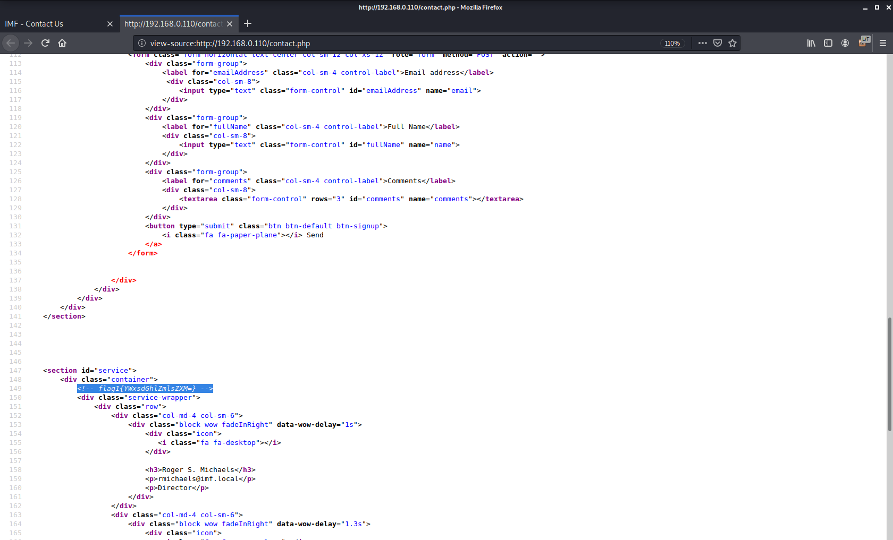
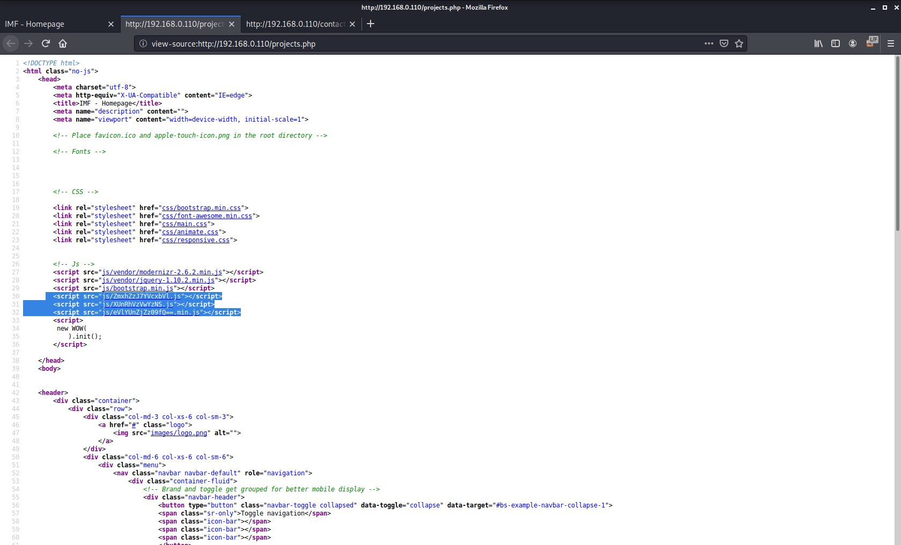
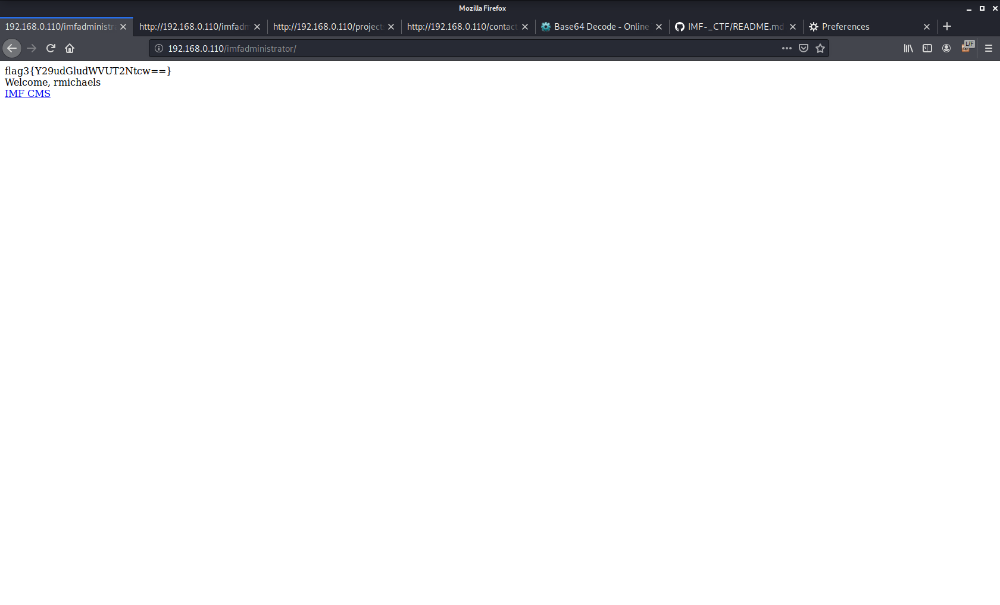
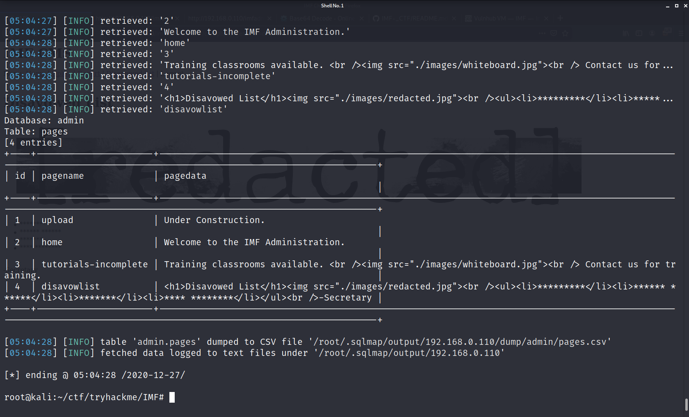
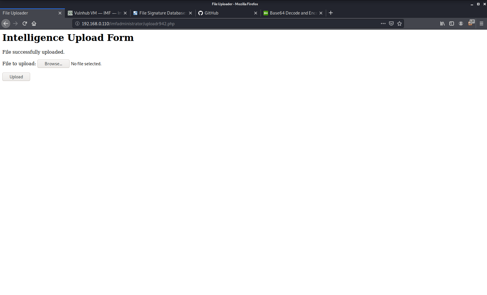
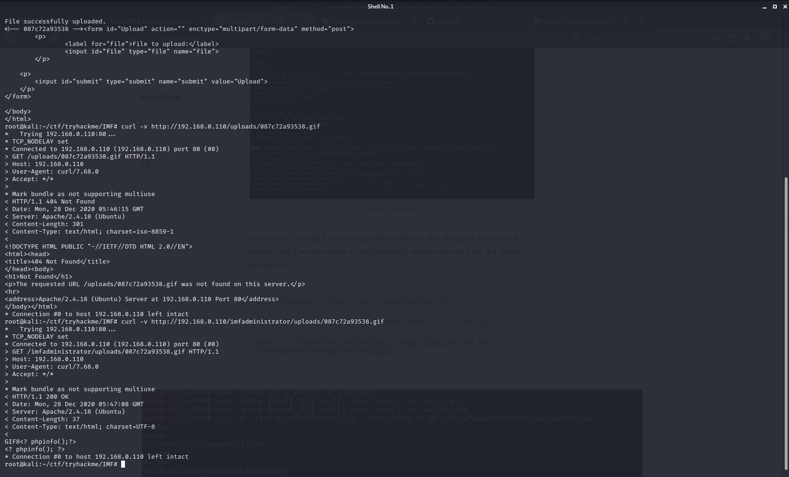

## ----------------------------------Basic Enumeration----------------------
Nmap scan:

PORT   STATE SERVICE VERSION
80/tcp open  http    Apache httpd 2.4.18 ((Ubuntu))
| http-methods: 
|_  Supported Methods: GET HEAD POST OPTIONS
|_http-server-header: Apache/2.4.18 (Ubuntu)
|_http-title: IMF - Homepage

Gobuster Scan:

/images (Status: 301)
/css (Status: 301)

/js (Status: 301)
/fonts (Status: 301)
/less (Status: 301)
/server-status (Status: 403)

## -----------------------------------------------------------------------

### -------------------------------------- all flags ----------------------

flag-1: flag1{YWxsdGhlZmlsZXM=}
YWxsdGhlZmlsZXM=(base64 encoded):allfiles

/////////////////////////////////////////
this part in the source code look supicious

        
        
        
///////////////////////////////////////////////

combining all the three we get a base64 encoded text
ZmxhZzJ7YVcxbVlXUnRhVzVwYzNSeVlYUnZjZz09fQ==

flag-2: flag2{aW1mYWRtaW5pc3RyYXRvcg==}

Hint after decoding the base64:imfadministrator

after going to /imfadministrator directry found a login page 

hint in the source code:
<!-- I couldn't get the SQL working, so I hard-coded the password. It's still mad secure through. - Roger -->
after a  little research i found a potential username from contacts emails
and try to 
bypass the login by changing the pass to pass[] by changing it 
password parameter when string is added to array parameter then it will return
null and the login is bypassed

flag-3 :  flag3{Y29udGludWVUT2Ntcw==}

hint after decoding the base64 text : continueTOcms

after sql injection i get manage to get flag4

flag4: flag4{dXBsb2Fkcjk0Mi5waHA=}
base64(dXBsb2Fkcjk0Mi5waHA=):uploadr942.php

this was found to be a directry name

------------------------------------------------------
it is restricting all .php files or containing .jpg.php 
we are not able to trick it.
but when simple images is uploaded
html>
<head>
<title>File Uploader</title>
</head>
<body>
<h1>Intelligence Upload Form</h1> 
File successfully uploaded.
<!-- be18dbc45dd7 --><form id="Upload" action="" enctype="multipart/form-data" method="post">
	
 
		<label for="file">File to upload:</label> 
		<input id="file" type="file" name="file"> 
	
 
                 
    
 
    	<input id="submit" type="submit" name="submit" value="Upload"> 
    
 
</form>

</body>
</html>

------------------------------------------------------
this is shown

decoding this {be18dbc45dd7} not get a meaningful string so it may be the
directry where all stuffed is uploaded but no!!!!
it is a name given to image uploaded to uploads directry however uploads
directry itself is forbidden

<!-- 087c72a93538 --> this is name of gif directry made with a gif signature
and appended with a simple phpinfo() function

flag-5 

at <ip>/imfadministrator/uploadr942.php

------------------------------------------------------------------------
